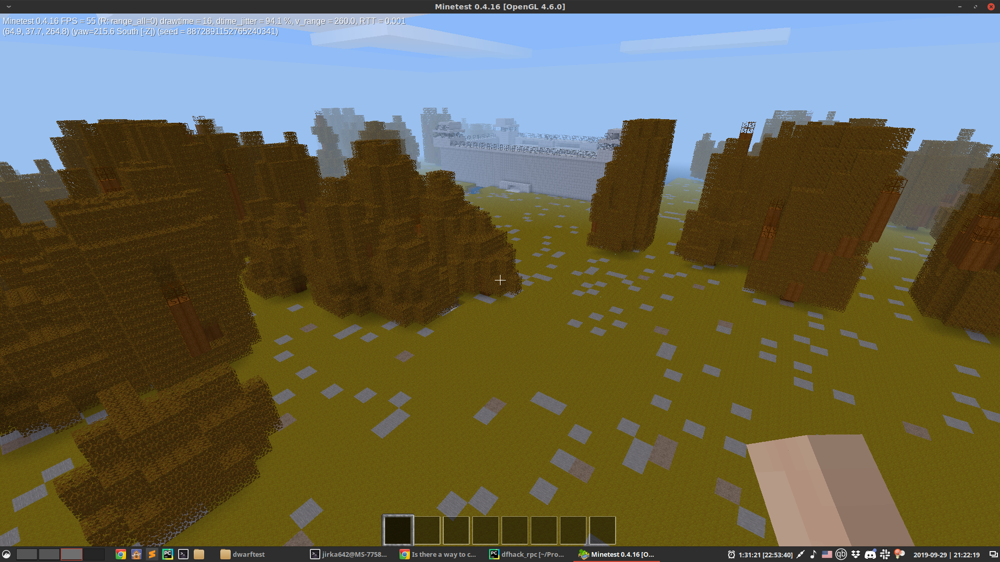

# DwarfTest

Tool for converting Dwarf Fortress map into Minetest map. Screenshots are in `doc` folder.




## Install

Get source code

```
https://github.com/kunesj/Dwarftest.git
cd Dwarftest
git submodule update --init --recursive
```

Install dependencies

```
sudo pip3 install protobuf numpy
```

Test run

```
python3 main.py --help
```


## Known Issues

### "List of block materials has invalid length! Try to restart Dwarf Fortress."

Restarting Dwarf Fortress should fix this. If anyone knows why it happens, please tell.

### Everything is in shadow

Running `\fixlight (0,0,0) (1000,1000,1000)` in Minetest should fix that.


## Development Resources

#### Dwarf Fortress

DFHackRPC is used for communication

https://github.com/kunesj/DFHackRPC

#### Minetest

https://rubenwardy.com/minetest_modding_book/en/basics/getting_started.html
https://github.com/minetest/minetest/blob/master/doc/lua_api.txt

